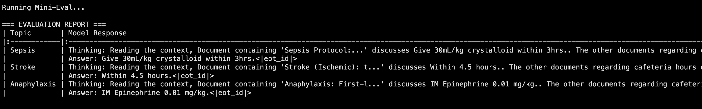

# Clinical-RAFT: Retrieval Augmented Fine-Tuning for Medical Reliability

## ⚡ Overview
**Clinical-RAFT** is a specialized implementation of the [RAFT (Retrieval Augmented Fine-Tuning)](https://arxiv.org/abs/2403.10131) paper, designed to improve the reliability of Large Language Models in clinical settings. 

Standard RAG (Retrieval-Augmented Generation) systems often hallucinate or get confused when retrieved documents contain irrelevant noise (e.g., hospital administrative logs mixed with clinical protocols). This project fine-tunes **Llama-3.2-3B** to explicitly:
1.  **Filter Noise:** Ignore "distractor" documents (e.g., cafeteria menus, IT policies).
2.  **Prioritize Facts:** Identify and ground answers in "Gold Standard" clinical guidelines.
3.  **Cite Sources:** Provide chain-of-thought reasoning citing specific document IDs.

## 🧪 Performance Demo
The model was evaluated on its ability to ignore administrative noise while retrieving urgent clinical protocols. As seen below, the model correctly ignores "Cafeteria" and "Parking" info to answer the medical question.

**Input Context Used:**
> * **Document [1]:** The hospital cafeteria serves pizza on Fridays.
> * **Document [2]:** Acute Coronary Syndrome (ACS): Dual antiplatelet therapy (Aspirin + P2Y12) should be administered immediately.
> * **Document [3]:** Parking structure B is closed for maintenance.

**Model Output:**
> **Thinking:** Reading the context, Document containing 'Acute Coronary Syndrome (ACS)...' discusses Immediately. The other documents regarding cafeteria and parking are irrelevant.
>
> **Answer:** Immediately upon diagnosis.

## 🏗️ Technical Architecture
* **Base Model:** Llama-3.2-3B-Instruct (Quantized to 4-bit via `bitsandbytes`).
* **Fine-Tuning:** QLoRA adaptation using **Unsloth** for 2x faster training and 60% memory reduction.
* **Data Strategy:** Synthetic generation of "Distractor" datasets (1 Gold Fact + 2 Irrelevant Documents) to simulate noisy vector retrieval.
* **Objective:** Optimized specifically for the RAFT format: `Question` + `Context` -> `Chain of Thought` -> `Answer`.
